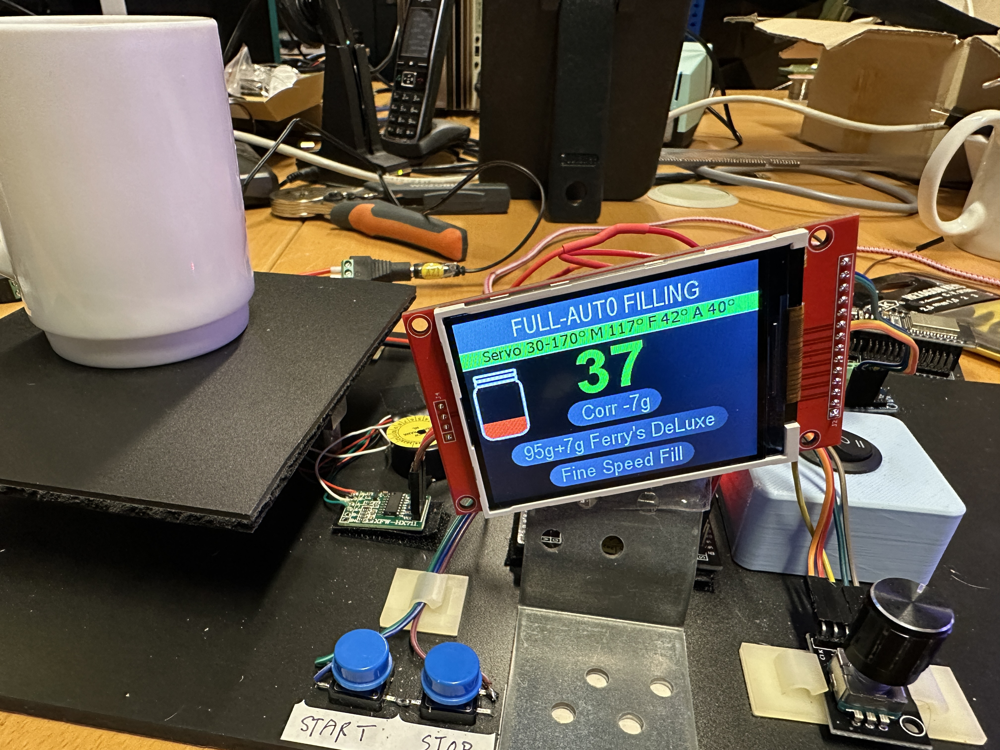

# HaniMandl for ESP32DEV board

First, thanks to all contributors for their work and inspiration. I decided to make my own fork as I intend to make a number of changes. 

Many changes are cosmetic, totally different looking user interface. 
Some changes are more technical, such as moving the loadcell reading to a background task.
Added multi language support. Right now it has English, German, Dutch, French, Spanish and Italian.
I hope the translations are acceptable, used Google translate for that.

Needs a 320x240 tft display, ST7789 model or ILI9341. 
Uses antialiased fonts for nicer display.
Use of graphic image as startup screen.

 

If you want to use ILI9341 display, see platformio.ini for build flags, and change ST7789_DRIVER=1 to ILI9341_DRIVER=1 

Is tailored to platformio which I prefer over the Arduino IDE

Work in progress, provided as is. It is not finished yet but i think it works - have to do more testing with a real setup.

I used the same pin layout as the original software, so you can check it out without any hassle of re-wiring.
If you don't like it, you can easily go back to the original.

Cheers, 
Frank

